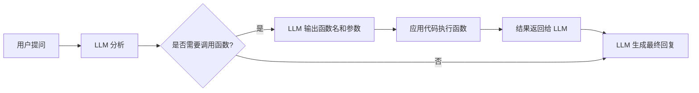
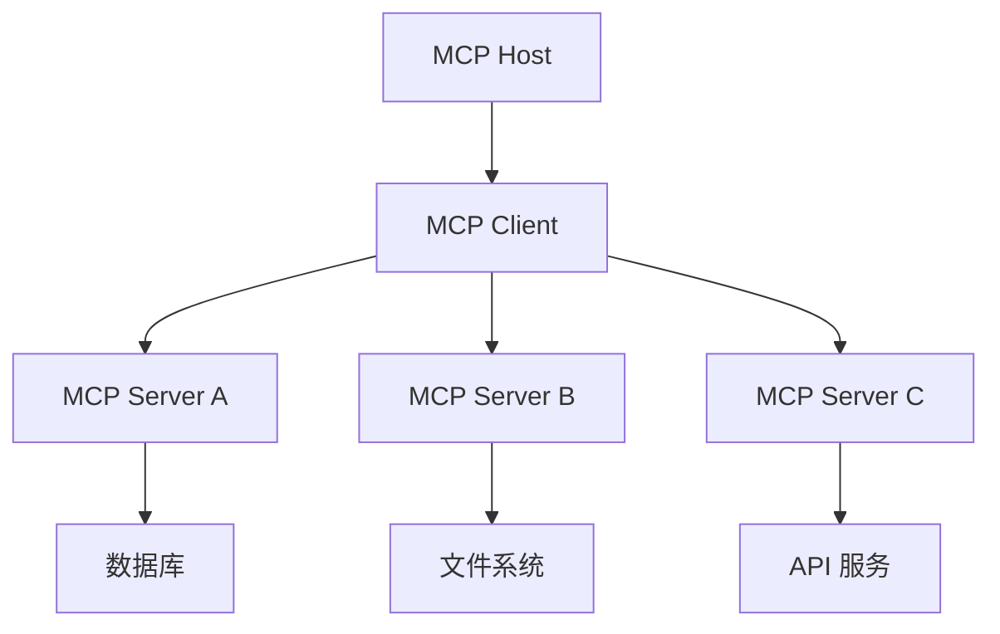
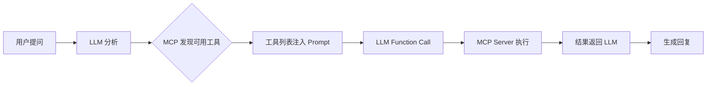

# LLM 中 Function Call 与 MCP 的区别

## 概述

在 LLM（大语言模型）应用开发中，**Function Call（函数调用）** 和 **MCP（Model Context Protocol，模型上下文协议）** 都是让模型与外部世界交互的重要机制，但它们在定位、层级和实现方式上存在本质区别。

---

## Function Call（函数调用）

### 定义

Function Call 是 LLM 提供的一种**原生能力**，允许模型在生成回复时识别需要调用的函数，并输出结构化的参数。

### 核心特点

| 特性 | 说明 |
|------|------|
| **层级** | 模型层面的能力 |
| **实现** | 由 LLM 提供商（如 OpenAI、Anthropic）定义 API |
| **调用方** | 应用代码直接调用 |
| **灵活性** | 需要开发者自行实现函数逻辑和调用流程 |
| **典型场景** | 调用天气 API、查询数据库、执行计算等 |

### 工作流程



### 示例代码

```python
# OpenAI Function Call 示例
tools = [
    {
        "type": "function",
        "function": {
            "name": "get_weather",
            "description": "获取指定城市的天气",
            "parameters": {
                "type": "object",
                "properties": {
                    "city": {"type": "string", "description": "城市名称"},
                    "date": {"type": "string", "description": "日期"}
                },
                "required": ["city"]
            }
        }
    }
]

# LLM 决定调用 get_weather(city="北京")
# 应用代码执行函数，结果返回给 LLM
```

---

## MCP（Model Context Protocol）

### 定义

MCP 是由 **Anthropic** 于 2024 年推出的**开放协议**，旨在标准化 LLM 与外部数据源、工具之间的连接方式。它是一个**更高层级的抽象**。

### 核心特点

| 特性 | 说明 |
|------|------|
| **层级** | 协议/框架层面 |
| **实现** | 标准化协议，支持多语言 SDK |
| **调用方** | MCP 客户端（如 Claude Desktop、IDE）自动管理 |
| **灵活性** | 一次接入，多处使用；工具可复用、可共享 |
| **典型场景** | 连接数据库、文件系统、API 服务、开发工具等 |

### 架构组成



| 组件 | 说明 |
|------|------|
| **MCP Host** | 运行 LLM 的应用程序（如 Claude Desktop、IDE） |
| **MCP Client** | 在 Host 内维护与 Server 的连接 |
| **MCP Server** | 提供特定功能的服务端（如数据库查询、文件操作） |

### 工作流程

1. **发现（Discovery）**：Host 通过 MCP 发现可用的 Server
2. **连接（Connection）**：Client 与 Server 建立标准通信
3. **调用（Invocation）**：LLM 通过 Function Call 触发 MCP 工具
4. **执行（Execution）**：Server 执行实际操作
5. **返回（Return）**：结果通过 MCP 返回给 LLM

---

## 核心区别对比

| 维度        | Function Call               | MCP                 |
| --------- | --------------------------- | ------------------- |
| **本质**    | LLM 的**原生能力**               | 连接 LLM 与工具的**协议标准** |
| **层级**    | 模型 API 层                    | 应用架构层               |
| **定义方**   | LLM 提供商（OpenAI、Anthropic 等） | Anthropic（开放协议）     |
| **实现复杂度** | 需自行实现每个函数的调用逻辑              | 按标准实现一次，自动适配        |
| **工具复用**  | 每个应用单独实现                    | 社区共享，一次接入多处使用       |
| **跨模型支持** | 各厂商 API 略有差异                | 协议统一，支持多模型          |
| **动态发现**  | 静态定义                        | 支持运行时动态发现工具         |
| **安全性**   | 应用自行控制                      | 标准权限模型，沙箱隔离         |

---

## 关系与协作

> [!important] 关键理解
> **MCP 并不取代 Function Call，而是建立在 Function Call 之上。**

MCP 的工作流程实际上是这样的：



1. MCP 负责**标准化工具的注册、发现和调用**
2. Function Call 负责**让 LLM 理解和使用这些工具**
3. 两者结合，实现了 LLM 与外部世界的**标准化、可复用连接**

---

## 类比理解

| 类比 | Function Call | MCP |
|------|---------------|-----|
| **编程语言** | 函数定义语法 | 函数库/包管理器 |
| **硬件** | CPU 指令集 | USB 协议标准 |
| **网络** | HTTP 请求方法 | REST API 规范 |

---

## 实际应用建议

### 何时使用 Function Call？

- 项目简单，工具数量有限
- 需要精细控制调用逻辑
- 快速原型开发
- 工具逻辑与业务深度耦合

### 何时使用 MCP？

- 需要连接多种外部数据源
- 希望工具可复用、可共享
- 构建可扩展的 AI 应用平台
- 需要跨团队、跨项目复用工具

---

## 总结

Function Call 是 LLM 的**手**，让它能够触达外部世界；MCP 是**"神经系统"**，标准化了手与大脑之间的连接方式。两者相辅相成，共同推动 LLM 从"聊天工具"向"智能代理"演进。

> [!tip] 一句话总结
> **Function Call 是能力，MCP 是协议；Function Call 让 LLM 能调用工具，MCP 让工具调用变得标准化、可复用。**
