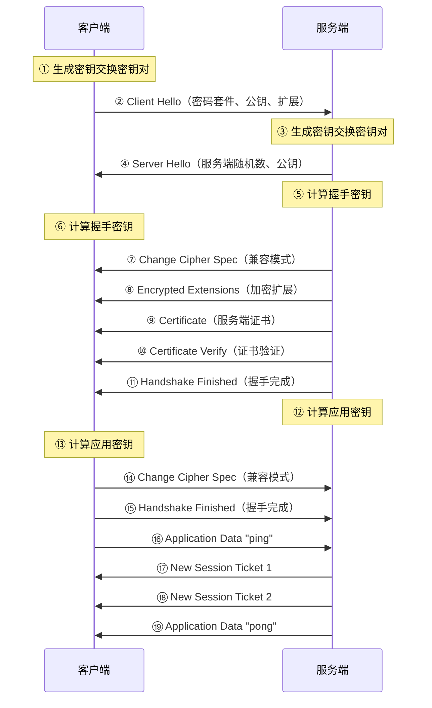

# TLS 1.3 握手过程详解

> 本文基于 [The Illustrated TLS 1.3 Connection](https://tls13.xargs.org/) 的交互式图解整理，逐字节分析 TLS 1.3 完整握手过程。
>
> 场景：客户端连接服务端，协商 TLS 1.3 会话，发送 "ping"，接收 "pong"，然后终止会话。

## 总体流程

TLS 1.3 握手相比 TLS 1.2 大幅简化，**1-RTT** 即可完成握手。以下是完整的消息交换流程：



---

## 步骤详解

### ① 客户端密钥交换生成

客户端首先生成一个用于密钥交换的私钥/公钥对。密钥交换是一种技术，使得两方可以在不被窃听者知道的情况下协商出相同的密钥。

- **私钥**：通过生成 32 字节（256 位）随机数据得到
- **公钥**：通过 X25519 算法从私钥计算得出

可以使用 OpenSSL 验证公钥计算：

```bash
openssl pkey -noout -text < client-ephemeral-private.key
```

---

### ② Client Hello

客户端发送 "Hello"，包含以下信息：

- **Record Header**（记录头）：`16 03 01 00 f8`
  - `16` — 类型为 0x16（握手记录）
  - `03 01` — 协议版本为 "3,1"（即 TLS 1.0），出于兼容性伪装成 TLS 1.0
  - `00 f8` — 248 字节的握手消息

- **Handshake Header**（握手头）：`01 00 00 f4`
  - `01` — 握手消息类型 0x01（Client Hello）
  - `00 00 f4` — 244 字节的 Client Hello 数据

- **Client Version**（客户端版本）：`03 03`
  - 伪装成 TLS 1.2（"3,3"），因为中间件已广泛部署，不允许不认识的协议版本
  - 实际版本协商通过下面的 "Supported Versions" 扩展进行

- **Client Random**（客户端随机数）：32 字节随机数据，用于后续会话

- **Session ID**（会话 ID）：`20` + 32 字节随机数据
  - TLS 1.3 使用 PSK（预共享密钥）机制恢复会话
  - 此处非空值用于触发"中间件兼容模式"

- **Cipher Suites**（密码套件列表）：
  - `TLS_AES_256_GCM_SHA384`（首选）
  - `TLS_CHACHA20_POLY1305_SHA256`
  - `TLS_AES_128_GCM_SHA256`
  - `TLS_EMPTY_RENEGOTIATION_INFO_SCSV`

- **Compression Methods**（压缩方法）：`01 00` — 仅支持空压缩
  - TLS 1.3 不再允许压缩（防止 CRIME 攻击）

- **Extensions**（扩展，163 字节）：
  - **Server Name (SNI)** — 服务器名称指示，使 HTTPS 服务器能在同一 IP 支持多个主机名
  - **EC Point Formats** — 支持的椭圆曲线点压缩格式
  - **Supported Groups** — 支持的密钥交换方法（X25519、secp256r1、X448 等）
  - **Session Ticket** — 空会话票据
  - **Encrypt-Then-MAC** — 支持 EtM（TLS 1.3 始终使用）
  - **Extended Master Secret** — 支持扩展主密钥
  - **Signature Algorithms** — 支持的签名算法列表
  - **Supported Versions** — `03 04` 表示支持 TLS 1.3（这是唯一暗示客户端支持 TLS 1.3 的地方）
  - **PSK Key Exchange Modes** — 预共享密钥交换模式

---

### ③ 服务端密钥交换生成

服务端也生成一个 X25519 私钥/公钥对，用于密钥交换。

---

### ④ Server Hello

服务端回复 "Hello"，包含以下信息：

- **Record Header**：`16 03 01 00 82`
- **Handshake Header**：`02 00 00 7e` — 类型 0x02（Server Hello）
- **Server Version**：`03 03`（伪装成 TLS 1.2）
- **Server Random**：32 字节服务端随机数据
- **Session ID**：与 Client Hello 中相同的会话 ID
- **Cipher Suite**：`13 01` — 服务端选择 `TLS_AES_128_GCM_SHA256`
- **Compression Methods**：`00` — 空压缩
- **Extensions**：
  - **Supported Versions**：`03 04` — 确认使用 TLS 1.3
  - **Key Share**：服务端选择的公钥 `3580...54`（与客户端相同的 X25519 密钥）
  - **Key Share** 条目包含服务端的公钥

---

### ⑤ 服务端握手密钥计算

服务端现在拥有所有必要的信息来计算握手加密密钥：

- 客户端和服务端的私钥/公钥（用于 ECDHE 密钥交换）
- 客户端和服务端的随机数

通过这些信息推导出：
- **握手握手密钥**（Handshake Secret）
- **服务端握手加密密钥**（Server Handshake Key）
- **服务端握手 IV**（Server Handshake IV）
- **客户端握手加密密钥**（Client Handshake Key）
- **客户端握手 IV**（Client Handshake IV）
- **服务端握手流量哈希**（Server Handshake Traffic Hash）

生成这些密钥后，后续的握手消息将被加密传输。

---

### ⑥ 客户端握手密钥计算

客户端收到 Server Hello 后，也进行与服务端相同的计算，基于拥有的所有信息推导出相同的握手密钥集。

---

### ⑦ Server Change Cipher Spec

在早期 TLS 版本中，此记录用于通知切换到新加密参数。TLS 1.3 已不再需要此步骤。

在"中间件兼容模式"下，发送此记录有助于将会话伪装成 TLS 1.2 会话。

---

### ⑧ Server Encrypted Extensions（加密扩展）

从这一步开始，连接（包括握手数据）被加密。这是 TLS 1.3 的新特性。

> 为了减少中间件拦截不认识的 TLS 协议的问题，记录被伪装成 TLS 1.2 的密文记录。

**Wrapped Record Header**：
- `17 03 03` — 应用数据记录 + TLS 1.2 版本
- 实际内容被加密

**Encrypted Extensions**：包含不需要协商加密密钥的扩展，如 ALPN（应用层协议协商）等。

---

### ⑨ Server Certificate（服务端证书）

服务端发送一个或多个证书：

1. **终端实体证书**（example.ulfheim.net）
   - 包含服务端的公钥（RSA 2048 位）
   - 证书版本、序列号、签名算法等信息
   - 有效期、主题信息（CN = example.ulfheim.net）
   
2. **中间证书**（RSA 2048 位）

证书使用 ASN.1 DER 编码，内容包含证书版本、序列号、签名算法、签发者、有效期、主题、公钥信息等。

---

### ⑩ Server Certificate Verify（证书验证）

服务端提供信息，将 Server Hello 中生成的公钥与证书中的公钥关联起来。

通过对握手上下文的哈希进行签名，证明服务端拥有与证书中公钥对应的私钥。

- 使用 **RSA-PSS-RSAE-SHA256** 签名算法
- 签名内容包括到目前为止的整个握手上下文哈希

---

### ⑪ Server Handshake Finished（服务端握手完成）

为验证握手成功且未被篡改，服务端计算验证数据，客户端将对其进行验证。

- 使用服务端握手密钥对握手上下文进行 HMAC 计算
- 包含 **verify_data** 字段

---

### ⑫ 服务端应用密钥计算

服务端现在有足够的信息计算用于加密应用流量的密钥：

- 使用握手阶段的握手密钥以及客户端和服务端的随机数
- 推导出 **应用加密密钥**（Application Secret/Traffic Key）

---

### ⑬ 客户端应用密钥计算

客户端也独立计算相同的应用加密密钥。

---

### ⑭ Client Change Cipher Spec

与第⑦步类似，用于中间件兼容模式，伪装成 TLS 1.2 会话。

---

### ⑮ Client Handshake Finished（客户端握手完成）

客户端计算验证数据，服务端将对其进行验证。

- 包含客户端对握手上下文的 **verify_data**
- 使用客户端握手密钥进行 HMAC 计算

---

### ⑯ Client Application Data（客户端应用数据）

客户端发送数据 "ping"（十六进制：`70 69 6e 67`）。

数据使用应用密钥加密：
- **Nonce** — 12 字节随机数（AEAD 构造）
- **Encrypted Data** — 加密后的 "ping" 数据
- **Authentication Tag** — 16 字节的 GCM 认证标签

---

### ⑰-⑱ Server New Session Ticket（服务端会话票据）

服务端提供会话票据，客户端可以在后续连接中使用它来恢复会话。

成功恢复连接将跳过大部分计算和网络延迟。由于每个会话票据应是单次使用的，且服务端预期浏览器会打开多个连接，因此服务端为每个协商提供两个会话票据（权衡大小与速度）。

---

### ⑲ Server Application Data（服务端应用数据）

服务端回复数据 "pong"（十六进制：`70 6f 6e 67`）。

---

## 总结

TLS 1.3 相比 TLS 1.2 的主要改进：

| 特性 | TLS 1.2 | TLS 1.3 |
|------|---------|---------|
| 握手往返次数 | 2-RTT | 1-RTT（0-RTT 恢复） |
| 加密握手 | 否 | 是 |
| 密码套件 | 大量复杂选项 | 仅 AEAD 算法 |
| 密钥交换 | 多种方式 | 主要使用 ECDHE |
| 会话恢复 | Session ID/Ticket | PSK（预共享密钥） |
| 压缩 | 支持（有 CRIME 攻击风险） | 不支持 |
| 前向安全性 | 可选 | 强制（通过 ECDHE） |
| 签名算法 | RSA-PKCS1 | RSA-PSS（更安全） |

## 参考

- [The Illustrated TLS 1.3 Connection](https://tls13.xargs.org/)
- [The Illustrated TLS 1.2 Connection](https://tls12.xargs.org/)
- [X25519 Key Exchange 图解](https://x25519.xargs.org/)
- [RFC 8446 - The Transport Layer Security (TLS) Protocol Version 1.3](https://tools.ietf.org/html/rfc8446)
